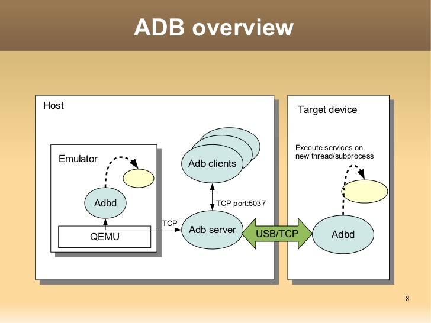
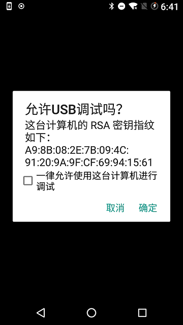
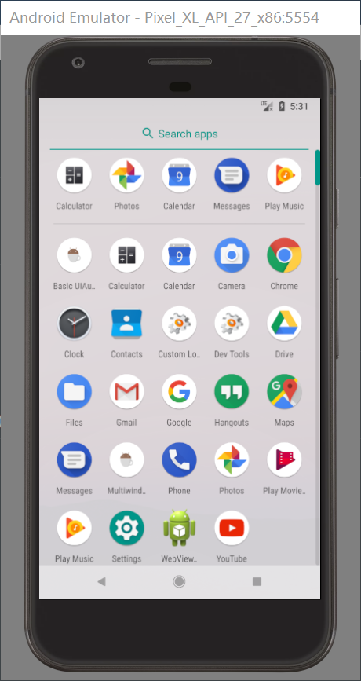
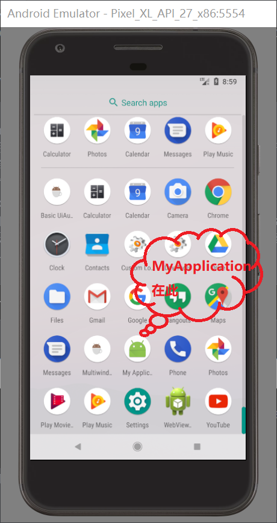
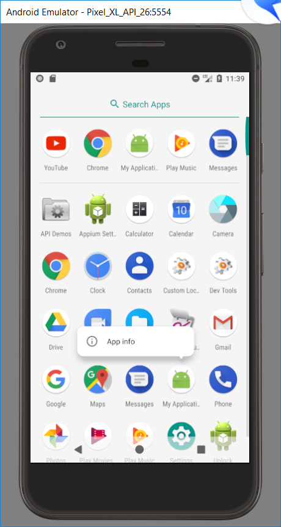
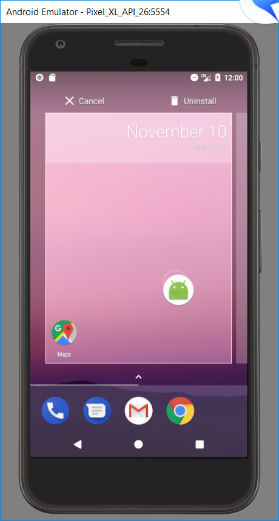
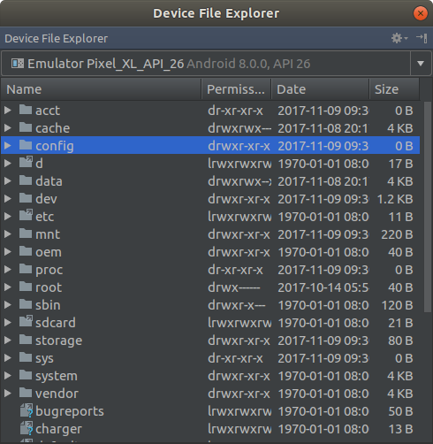
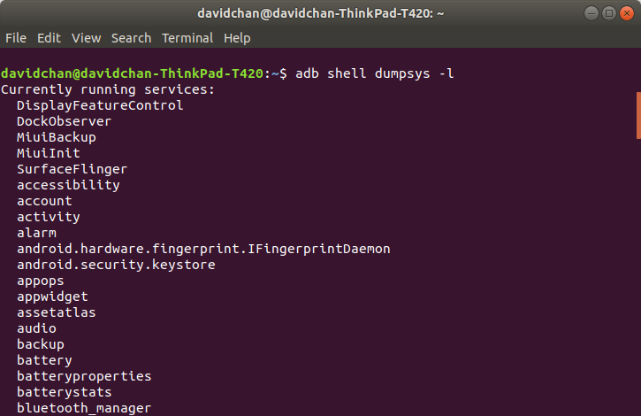

# <center> Android ADB常用命令说明 </center>


## <center> 序言 </center>
　　自从Google推出Android Studio之后，我们平常在开发APP的过程中，代码的编写、程序的编译、
模拟或真机环境的APK测试，基本上所有的工作都是在Android Studio这个大IDE下完成。
　　因此，也就有很多新开发工程师都不知道ADB是什么。
```
                      ADB是啥，是“俺的吧”，是“爱豆瓣”，อิ_อิ
```
　　作为一个"一本正经"的“攻城狮”，好吧，我承认我被你Get到了。但在Android的世界里，你对
ADB的臆测，我还是要说你是“一本正经地胡说八道”。

## 一、ADB基本概念
　　这个世界是有套路的，技术文献的写作也不外如是。虽然本文似乎还离文献这么个高大尚的词汇
仍有很大的距离，但本狮决定还是套用一下套路（但不排除行文中仍有插科打诨的嫌疑）。照例地从
名词解释开始，照例地从百度百科开始：
>ADB  
>亚洲开发银行 (简称“亚行”Asian Development Bank -- ADB) 是亚洲、太平洋地区的区域性政府间国际金融机构。它不是联合国下属机构，但它是联合国亚洲及太平洋经济社会委员会（联合国亚太经社会）赞助建立的机构，同联合国及其区域和专门机构有密切的联系。  

　　百科上一搜，“非洲佬跳高”——黑（吓）老子一跳。亚行，能与我们大Android有什么关系呢？一跳之后也就没啥了，百度嘛，有钱好办事，亚行这么有钱，排在前面是很正常的（开个玩笑）。事实是，百度百科根本不会像维基百科那样去维护一个消歧义页面，而是只会把可能的释义堆砌在同一个页面上。因此，既然亚行与我们没什么关系的话，我们照例接着往下翻就好了。好在不是很远，我们便见到ADB在大Android世界的释义。
>**调试桥**  
>概述  
>adb的全称为Android Debug Bridge，就是起到调试桥的作用。通过adb我们可以在Eclipse中方便通过DDMS来调试Android程序，说白了就是debug工具。adb的工作方式比较特殊，采用监听Socket TCP 5554等端口的方式让IDE和Qemu通讯，默认情况下adb会daemon相关的网络端口，所以当我们运行Eclipse时adb进程就会自动运行。  

　　好吧，好吧！百度家的，你行，很好，用概念解释概念，干得漂亮！作为一个小白攻城狮，我完全不能理解你在说什么！  
　　好吧，我们再花点时间，花点力气，看看大洋彼岸的wikipedia能给我们哪些不一样的说法！  
>The Android Debug Bridge (ADB) is a toolkit included in the Android SDK package.  
>It consists of both client and server-side programs that communicate with oneanother. The ADB is typically accessed through the command-line interface, although numerous graphical user interfaces exist to control ADB.  

　　大意就是adb是包含在SDK中的一套工具。由客户端及服务端程序组成，它们互相通信。其典型访问方式是通过命令行接口使用，也可以使用大量的已有图形接口来控制ADB。  
　　好吧，这个到底干嘛用的，百度家的和喂鸡家的，说了都等于没说。尝试自己来解释一下吧。  
　　如果你调试过Linux本机程序，你一定知道GDB的存在。GDB也就是GNU Debugger, 是由GNU的调试工具，通过它你可以采取包含设置断点在内的一系列措施来调试你的Linux桌面程序。  
　　而对于Android来说，由于整个系统都不在PC上运行，因此GDB根本就够不着它，再加上其Java与C/++有着本质的区别，即便GDB够着它，也基本上没什么用。  
　　因此Android需要一套新工具来实现类似GDB的功能，这套工具就是ADB，当然你不简单地说它是Android Debugger。因为它的调试控制端是运行的PC上的，而执行端是在设备上的。其整体结构如下图所示。
        <div><center></center>
  　严格意义上来说整个工具由三部分组成：  
  　1. 运行在设备或是Emulator中的adbd  
  　2. 运行在PC上的ADB服务，由adb.exe首次运行时创建。通过connect命令连接上设备或Emulator中运行的adbd后创建。（adb.exe为在Windows下的程序文件名称，Linux或Mac版程序文件名就为adb）  
  　3. 运行与服务相同PC上或是其他PC上的adb client，adb.exe本身也是一个adb client。  
　　具体的指令由adb client发出，adb server将指令转发给相应的adbd，而最后由adbd来完成在特定设备上的指令执行。  
　　因此，官方给其取名叫Android Debug Bridge，还是非常恰当的。  
  　扯了这么多，概念也有了一个大致的了解，下面我们就来看看adb都可以玩什么。当然这里主要是指adb.exe怎么耍。其他的adb client在这里我们不作介绍。
## 二、Adb指令分类
　　ADB指令共分为如下几类：
    * general commands: 一般指令
        devices [-l]          列出已经连接的设备
        help                  打印帮助信息
        version               显示版本号
    * networking: 网络指令
        connect HOST[:PORT]   通过<TCP/IP>[:PORT]来连接设备，PORT默认为5555
        disconnect [HOST[:PORT]]
                              断开[HOST[:PORT]]指定的设备，无参数则为断开全部设备
        forward --list        列出全部重定向SOCKET连接
        forward [--no-rebind] LOCAL REMOTE
                              重定向SOCKET连接
        forward --remove LOCAL
                              移除指定的重定向SOCKET连接
        forward --remove-all  移除全部重定向SOCKET连接
        ppp TTY [PARAMETER...]
                              在USB上运行PPP
        reverse --list        列出设备上的全部反向连接
        reverse [--no-rebind] REMOTE LOCAL
                              进行反向连接
        reverse --remove REMOTE
                              移除指定的反向连接
        reverse --remove-all  从设备上移除全部反向连接
    * file transfer:  文件传输指令
        push LOCAL... REMOTE  从本地向远程推送文件或文件夹
        pull [-a] REMOTE... LOCAL
                              从远程抓取文件或文件夹
        sync [DIR]            将所有发生改变的文件同步到设备
    * shell: Shell指令
        shell [-e ESCAPE] [-n] [-Tt] [-x] [COMMAND...]
                              远程运行Shell指令，如无参数则交互式运行
        emu COMMAND           运行Emulator控制台指令


    * app installation:  APP安装指令
        install [-lrtsdg] PACKAGE
                              安装PACKAGE
        install-multiple [-lrtsdpg] PACKAGE...
                              安装多个PACKAGE...
        uninstall [-k] PACKAGE
                              卸载PACKAGE

    * backup/restore:  备份及恢复
        backup [-f FILE] [-apk|-noapk] [-obb|-noobb] [-shared|-noshared] [-all] [-system|-nosystem] [PACKAGE...]
                              备份设备内容到FILE
        restore FILE          从FILE恢复设备内容

    * debugging:  调试相关
        bugreport [PATH]      生成bugreport
        jdwp                  列出JDWP传输的进程ID
        logcat                显示设备的日志

    * security:  安全相关
        disable-verity        禁用userdebug生成的系统的dm-verity检查
        enable-verity         启用userdebug生成的系统的dm-verity检查
        keygen FILE           生成adb公/私钥，私钥保存为FILE，公钥保存为FILE.pub

    * scripting:
        wait-for[-TRANSPORT]-STATE
                              等待设备进入指定状态：device、recovery、sideload，或
                              是bootloader。TRANSPORT可以是：usb、local、any
        get-state             将显示为offline、bootloader或是device中的一种
        get-serialno          取得设备序列号
        get-devpath           取得设备的device-path
        remount               以可读写模式重新挂载/system、/vendor，及/oem分区
        reboot [bootloader|recovery|sideload|sideload-auto-reboot]
                              重新启动设备到指定的模式
        sideload OTAPACKAGE   通过sideload载入指定的完整版本OTA升级包
        root                  以root权限重启adbd   restart adbd with root permissions
        unroot                重启adbd，并关闭root权限
        usb                   重启监听于USB上的ADB服务
        tcpip PORT            重启监听指定TCP PORT的ADB服务

    * internal debugging:
        start-server          启动服务   ensure that there is a server running
        kill-server           当掉正在运行的服务   kill the server if it is running
        reconnect             从服务端踢掉连接并强制重新连接
        reconnect device      从设备端踢掉连接并强制重新连接

## 三、与日常调试/自动化测试关联度高的指令实例讲解
### 3.1 adb devices —— 枚举设备
　　adb devices的指令，就是为我们列出目前adb服务已经连接的设备有哪些。只要在命令行中执行“adb devices”即可，其执行结果如下图所示。
        <div><center></center>  
　　本次执行，列出的设备列表为空，原因很简单，我们目前尚未连接任何设备也未启动Emulator，因此这里是不可能显示出任何设备的。
　　现在让我们启动一个Emulator如下图所示，怎么创建并启动Emulator不在本文讨论范围。  
        <div><center></center>  
　　我们再执行一次“adb devices”，看一下输出。  
        <div><center></center>  
　　现在我们将一部Android手机打开USB调试模式后通过USB连接到运行adb程序的PC上，然后再次运行“adb devices”，我们将得到如下图的输出。  
        <div><center></center>  
　　从上面几个示例中我们可以看出，“adb device”的输出信息有两列，分别是设备序列号、设备状态。设备状态可能是offline，unauthorized或device。  
　　对于Emulator通常不会出现offline及unauthorized这两个状态，要么显示为device，要么干脆不在列表里出现。  
　　最有可能出现offline的是通过USB及TCP协议连接的设备，比如一个已经连接的手机，你未将USB连接断开就直接重启，就会出现offline的状态。  
        <div><center></center>  
　　而unauthorized通常出现在设备已经开启adb调试功能，并连接到adb服务所在的PC，但是尚未对该PC进行授权以允许该PC对设备进行调试，即下图中的确定还未点击。   <div><center></center>  
　　对于手机等设备来说，出现offline状态后，你只需重新拔插一下USB线缆，ADB服务与设备之间就可以重新进入到device状态。  
　　有时候我们希望获得更为详细的设备信息，只需要在指令后面加上“-l”参数即可。  
        <div><center></center>  
　　与不带“-l”参数相比，后面多出来了“产品|型号|平台”等相关信息。  
### 3.2 adb install —— 安装APP  
　　“攻城狮”也好，“程序猿”也罢，在调试或测试APP过程中都免不了需要将程序安装到设备中去。在日常使用手机过程中，我们安装APP通常都是通过手机内置的应用商店直接安装。偶有时候也会通过电脑下载来某个APP的apk文件，然后将这个apk文件通过电脑复制到手机的所谓内存中去，再在手机的文件管理器中点击该apk文件根据提示进行相关安装操作，再或者通过诸如豌豆荚、腾讯手机助手等相关软件来协助安装。  
　　但这些方法，总是有那么一点太不“攻城狮”了，太不“程序猿”了。对于“攻城狮”、“程序猿”们来说：能在PC上操作的就决不用在设备上操作，能用键盘搞的就尽量少动鼠标。因此上面那些安装方法，虽说可行，但都不太理想。而“adb install”就是比较“攻城狮”、比较“程序猿”的安装方法。  
　　在安装之前，我们先看一下Emulator上没有除自带APP之外未安装其他应用之前的情况。如下图就是API 27 Emulator的默认APP列表。  
        <div><center></center>  
　　现在我使用adb install来在Emulator上安装通过Android Studio生成的最简单的APP MyApplication.apk。安装的命令是：  
        <table><tr><td bgcolor=black><font color=white>　　> adb install MyApplication.apk　　　　　　　</td></tr></table>
　　可是我们得到的结果是一顿抱怨，而不是成功的喜悦。  
        <div><center></center>  
　　这是什么鬼？“error: more than one device/emulator”。  
　　让我们好好的想一想，前面我们开了一Emulator，还在这台PC上连接了一个开启了USB调试功能的手机。那好吧，确实不是adb的错，也不是“adb install”语法不对，确实是我们现在adb服务上已经连接上了两个设备：一个Emulator，以及一个手机。虽然我们知道我们想给Emulator安装APP，而adb.exe虽然智能，但并不人工智能。  
　　既然，默认方法不好使，我们还是踏踏实实地明确的使用“-s”参数告诉adb我们想访问的是哪一个设备。指定设备的方法即为“-s”参数后接设备序列号，对于本案的Emulator，其序列号为“emulator-5554”，因此给Emulator安装APP的命令如下：  
        <table><tr><td bgcolor=black><font color=white>　　> adb -s emulator-5554 install MyApplication.apk　　　　　　　</td></tr></table>
　　这一次安装反馈如下图所示：  
        <div><center></center>
　　那我们再来看一下Emulator的APP列表。  
        <div><center></center>  
　　如果同名APP已经存在，我们还试图往设备上安装APP，我们将得到如下的错误提示：  
        <div><center></center>    
　　这时候你可以选择卸载APP，然后再重新安装，卸载的方法，稍候再讲。而实际开发调试过程中“攻城狮”“程序猿”们在调试APP时，有时候往往需要保留APP的数据，这就意味着不能选择先卸载再安装这条路，也就意味着我们必须学会覆盖式安装。还好google设计adb时已经给我们留好了这样的一条路。就是以参数来执行安装指令。本例中覆盖式安装MyApplication的命令如下：  
        <table><tr><td bgcolor=black><font color=white>　　> adb -s emulator-5554 install -r MyApplication.apk　　　　　　　</td></tr></table>
　　一次性安装多个APP的指令如下：  
        <table><tr><td bgcolor=black><font color=white>　　> adb -s emulator-5554 install-multiple -r App1.apk  App2.apk ...　　</td></tr></table>
　　当然，安装指令除了-r
### 3.3 adb uninstall —— 卸载APP
　　上一节，我们介绍了安装APP的信息，这一节，我们来看看如何卸载APP。说实话，作为一个“攻城狮”，其实我是十二分不情愿来讲如何卸载APP。如上一节所述，即使我们需要重装APP，我们也可以使用上一节的“adb install -r”来实现一次覆盖式安装。但既然讲述了安装APP，我们也就顺便讲一下卸载APP吧。  
　　与安装APP一样，卸载APP其实也有很多种方法。但主要的方法其实也就是下面这几种：  
#### 3.3.1 设备上常规删除方法  
　　原生Android Oreo设备上，按住APP图标不放，待屏幕上出现“App info”气泡（当语言设为中文时为“应用信息”）时，向上方拖动APP图标。  
　　    <div><center></center>  
　　此时界面上方出现一个注名为“Uninstall”的垃圾筒图标(中文环境下为卸载)，如下图所示：  
        <div><center></center>  
　　继续向止拖动APP图标，到那垃圾筒上。然后，然后APP就没有了。就是那么神奇，有木有？  
　　非原生设备，其实也差不多，大体也都是从按住APP图标不放，...  
#### 3.3.2 通过工具卸载  
　　如同前面所述，豌豆荚、腾讯手机助手、360手机助手，有太多太多的软件可以从电脑上直接向设备中安装APP。而这些助手类工具在身为一大安装器的同时，还兼着一个更加神圣的使命，那就是可以让大家在电脑上操作来卸载设备上的APP。  
　　这些助手类工具的使用，请自行百度或脑补，这里我们不再详述。  
#### 3.3.3 通过ADB接口来删除  
　　其实前述的助手类工具安装或删除，其本质大多也都属于通过ADB接口来删除，只不过与“攻城狮”，“程序猿”直接调用命令不同，那些助手已经将ADB命令藏在助手程序里面了而已。  
　　前面我们说过，adb.exe本身就是一个ADB Client，实际上这也是一个功能相当完善的ADB Client。除了没UI、没有相对应的应用商店外，那些助手有的ADB Client也都不缺。因此卸载个把程序对adb.exe来说也不在话下。  
　　举个栗子，假如我们要删除的MyApplication的包名为“cn.org.uefi.myapplication”，则我方卸载MyApplication这个APP的命令为：  
        <table><tr><td bgcolor=black><font color=white>　　> adb -s emulator-5554 uninstall cn.org.uefi.myapplication　　　　　　　</td></tr></table>
　　关于怎么确定包名：如果这个APP是由您本人或是您本人所在的团队开发的，那么您可以直接去问相关的开发人员，这个包名是什么，这是比较简单粗暴的方法。至于系统中以其他方式安装的APP应该如何确定包名，我们在后面讲解ADB Shell指令时介绍。  
　　假如您希望在卸载APP时保留APP的数据及缓存，可以使用参数“-k”来调用卸载指令。  
        <table><tr><td bgcolor=black><font color=white>　　> adb -s emulator-5554 uninstall -k cn.org.uefi.myapplication　　　　　　</td></tr></table>
### 3.4 adb connect —— 通过TCP/IP的方式来连接一个设备
　　有时个我们希望连接的设备不方便通过USB来连接，甚至就没有Target USB接口而无法作为设备连接到我的调试计算机上。这时我们就需要以TCP/IP的方式来连接并调试相关设备。  
　　要通过TCP/IP的方式来连接并调试设备，如果你的设备上有独立的“Network ADB”（网络ADB）开关，那么请在“Developer options”（开发者选项)中打此开关。这样您就可以通过网络ADB来连接并调试设备。具体开启动开发者选项的方式，我们不在这里描述。  
　　我个人的一个设备，其通过wifi连接后分配到的IP是192.168.1.11，那么此时我只要像下面这样连接他即可。  
        <table><tr><td bgcolor=black><font color=white>　　> adb connect 192.168.1.11　　　　　　</td></tr></table>
　　在我的PC上，该命令的执行结果如下：  
        <div><center></center>  
　　此时通过“adb devices”指令显示的信息如下  
        <div><center></center>  
　　WHAT？ “unauthorized”，好吧确实是unauthorized。其实这也没什么好奇怪的，毕竟这是第一次连接这个设备，如果是个人都能通过TCP/IP的方式ADB到你的手机、平板、电视，那这个世界得多可怕，而这样的事情，当是也是Google是所不希望发生的。虽然我让你连上了，但是在我批准之前，我是处于所谓unauthorized状态的。那么，我们要如何批准呢！这时拿起我们的设备，对本次实验来是，这是一台装有lineage os的Android手机，此时的手机屏幕显示如下。  
        <div><center></center>  
　　屏上内容即是询问要否批准本次ADB设计，当然标题“Allow USB debugging?”是不太对的，这应该是Lineage OS小小的疏漏。没关系，我们点击确定就好，然后再用“adb devices”指令看一下。  
        <div><center></center>  
　　现在我的这台机器的ADB Server上共挂上了三台设备，分别是：通过192.168.1.11这个IP连接的一台手机，一台通过USB连接的手机，以及一个Emulator。  
　　当然，有时候某上设备上的adbd daemon程序可能不一定设定在默认端口5555上。则此时我们需要以IP:PORT这样的形式来对该设备做“adb connect”。 如，假设为5559端口，则命令如下：
        <table><tr><td bgcolor=black><font color=white>　　> adb connect 192.168.1.11:5559　　　　　　</td></tr></table>
　　某些设备可能有“开发者模式”中没有“网络ADB”的相关选项，请参考后面的“adb tcpip”指令的用法来打开网络ADB功能。  
### 3.5 adb disconnect —— 断开与某个设备的连接  
　　前面我们学会了如何以TCP/IP的方式来连接某个设备,那我们下面再看看如果将该设备从ADB服务中断开。  
　　断开一个设备非常简单，执行一条“adb disconnect”指令即可，其参数要断开设备的IP:PORT，还以我刚才的运行Lineage OS的Android手机为例，完整的指令为：  
        <table><tr><td bgcolor=black><font color=white>　　> adb disconnect 192.168.1.11:5559　　　　　　</td></tr></table>
　　**注意**:“adb disconnect”仅适用于基于TCP/IP方式连接的设备。对于通过USB连接的手机、平板或是电视，断开相连的USB线缆，自然就断开了相应的调试连接。  
### 3.5 adb pull —— 发送文件到设备  
　　有时候，在测试过程中，我们可能希望临时发送一些脚本或是配置文件到设备中，以便快速的做一些测试。这时我们就需要用到“adb pull”指令来向设备发送文件。  
　　假设我们有个文件abc.txt要发送到Emulator的/storage/emulated/0文件夹下，则我们的指令应该是：  
        <table><tr><td bgcolor=black><font color=white>　　> adb -s emulator-5554 push abc.txt /storage/emulated/0　　　　　　</td></tr></table>
　　其实我们通常也只能往设备的/storage/emulated/0或是其下级文件夹乃至更下级文件夹中发送文件。下面我们试着为Emulator的/data文件夹下发送abc.txt，看看会发生什么。  
        <div><center></center>
　　很显然，我们的企图没有得逞，主要是因为为了Android设置了较为严格的安全策略，普通权限的指令只允许访问有限的存储空间。而对大部分设备来说，这个空间就是/storage/emulated/0或是其简短路径/sdcard。  
　　另外，我们也可以整个文件夹向设备发送，只需要将push指令的第一个参数从文件变更为文件夹的路径即可。如我们要发送文件夹ADirectory，则完整的指令应该是：
        <table><tr><td bgcolor=black><font color=white>　　> adb -s emulator-5554 push ADirectory /storage/emulated/0　　　　　　</td></tr></table>

### 3.6 adb pull —— 从设备中取出文件  
　　某些程序执行完，可能将结果保存在设备上，而我们在测试的过程中需要将相关的结果取回，以评估APP运行是否如预期。当我们在测试过程中需要取回相应的文件时，“adb pull”指令可以完成相应的工作。  
　　假设，我们需要评估的程序会在/storage/emulated/0/MyApplication/testResult.dat中保存相关数据，则我们取回该数据的指令调用如下：  
        <table><tr><td bgcolor=black><font color=white>　　> adb -s emulator-5554 pull /storage/emulated/0/MyApplication/testResult.dat ./　　　　　　</td></tr></table>
　　其实不论是发送文件到设备中，还是从设备中取出文件，都还可以通过Device File Explorer来进行。Device File Explorer是Android Studio中的一个小工具。可以通过菜单 “View | ToolWindows | Device File Explorer”来打开。  
        <div><center></center>  
### 3.7 adb sync —— 同步设备  
　　通常对做应用开发的“程序猿”及单个应用测试的“攻城狮”而言，“adb sync”是一条不大可能用到的指令，因为“adb sync”的作用比较特殊，它的作用是将整个系统中诸如/system、/oem、/vendor及/data分区与主机对应目录不一致的内容同步到设备上。  
　　虽说对应用开发的“程序猿”及单个应用测试的“攻城狮”而言，“adb sync”作用不大，但由其作用可以看到，adb sync指令对系统测试“攻城狮”而言是一个意义重大的指令。其可以帮助我们跳过一系列繁琐的过程，直接将系统同步到最新生成的系统版本，如我们有一套基于Android 8.1开发的系统HIPPOS 2017.a0.00，我们测试过程中发现了Android 8.1一系列的BUG，我们对其修正后，编译生成了新的2017.a0.10。那么我们就可以非常方便的通过“adb sync”指令将所有的测试设备由HIPPOS 2017.a0.00同步成最新版本的HIPPOS 2017.a0.10。  
　　“adb sync”指令在使用前需要系统中存在环境变量ANDROID_PRODUCT_OUT。  
　　如果系统中没有设置相应的环境变量，则我们将会得到一个“Product directory not specified”的提示，如下图所示。（注：从这里开始，除非特别需要，我们的系统都只接一个设备，来完成本文后续所需要用到的每一个测试，因此命令adb后面不会再跟着-s参数指出要访问的是哪一个设备。）  
        <div><center></center>  
　　若我们只是偶尔同步一回系统，我可以通过-p参数来指定之前编译系统所生成的system、data等文件夹父文件夹。如在我当前的Linux主机上的，HIPPOS的OUT文件夹的路径为~/aosp/out/target/product/hippos，则临时性同步HIPPOS到设备的指令为：  
        <table><tr><td bgcolor=black><font color=white>　　$ adb sync -p  ~/aosp/out/target/product/hippos ./　　　　　　</td></tr></table>
　　若是我们需要频繁做相关的测试，建议还是设备环境变量ANDROID_PRODUCT_OUT。  
        <table><tr><td bgcolor=black><font color=white>　　$ echo export ANDROID_PRODUCT_OUT=~/aosp/out/target/product/hippos > ~/.profile  　</td></tr></table>
　　设置完ANDROID_PRODUCT_OUT后，PC下次重启之后，就可以以不带参数的方式来执行“adb sync”指令来同步设备。  
        <table><tr><td bgcolor=black><font color=white>　　$ adb sync　　　　  　</td></tr></table>
　　实际使用过程中，可以根据自己的需要，选择上两种方式中的一种来指定ANDROID_PRODUCT_OUT路径。  
　　同步过程中，系统的输出类似下面的信息：  
        <table><tr><td bgcolor=black><font color=white>　　syncing /system...<br>
        　　push:　~/aosp/out/target/product/hippos/system/app/WAPPushManger.apk ->   　　/system/app/WAPPushManger.apk　　　  　</td></tr></table>
　　有些时候，我们可能只希望对/system、/oem、/vendor，或是/data这样的分区中的一个进行同步，此时只需要在“adb sync”指令后面加上参数“[DIR]”，[DIR]可以是system、oem、vendor，或是data。如，我们只希望同步/oem分区，则指令应写为：　
        <table><tr><td bgcolor=black><font color=white>　　$ adb sync system　　　  　</td></tr></table>
### 3.8 adb shell指令不完全讲解
　　Android脱胎于Linux，不管其外在表面是多么的大家闺秀，还是多么的小家碧玉，其内在都有着邻家姑娘一样朴实无华过日子的心。与Linux一样，Android支持常见的命令，这些命令都保存在设备的/system/bin目录。在这个目录下面我们可以看到平时在Linux系统下面常见的一些命令，如“ls、ps、df、time、kill”等。通过adb,我们可以以两种方法来调用这些命令：  

**「交互式执行」**  
　　交互式执行，即以不带参数的形式运行adb shell指令，打开一个交互式的shell环境，然后像使用本地Linux终端一样来输入并执行相关的命令。其运行的效果，如下图所示：  
        <div><center></center>  
　　运行完毕要退出交互式shell环境，输入并执行命令“exit”即可。  
**「直接执行」**  
　　直接执行，即不打开交互式终端，由adb shell指令后面跟上要执行的指令及其参数组成。格式为“adb shell [COMMAND] [PARAMETER]”，如下图所示:  
        <div><center></center>  
　　值得注意的是，参数中需要转义的字符在交互式shell中只需要一次转义，而在直接执行过程中需要两次转义才行。  
　　下面讲述一些与Android调试及测试密切相关的shell命令，其他的泛泛的linux命令，不在本文档的论述范围之内。  
#### 3.8.1 dumpsys  
　　Android是一个比较庞大的系统，这个系统里运行了很多的服务，在调试过程中我们经常会需要查看一下相关服务的信息。dumpsys就是用来转储这些信息的一个非常好用的工作。  
　　要知道设备上当前有哪些服务是可以进行dumpsys的,可以以“-l”选项,不加参数的方式运行dumpsys命令：  
        <table><tr><td bgcolor=black><font color=white>　　$ adb shell dumpsys -l 　　　  　</td></tr></table>
　　执行“adb shell dumpsys -l”，将列出当前统上的全部可dumpsys的服务。其输出如下图所示：  
        <div><center></center>
　　下面以获取电池信息为例，讲述一下，获取电池信息的dumpsys命令如下：  
        <table><tr><td bgcolor=black><font color=white>　　> adb shell dumpsys battery　　　　　　</td></tr></table>
　　其输出信息如下：  
      　 <div><center></center>  
　　关于dumpsys其他服务的细节内容，就不在本文里一一讲述。  
#### 3.8.2 logcat  
　　adb shell logcat，以及adb logcat 均是提供查看设备的日志功能，用法也一样，只不过一个是直接通过shell来调用，一个是直接通过adb 接口来访问。关于logcat的使用细节，请参考“万境绝尘”在CSDN上的博客[《adb logcat 命令行用法》 http://www.hanshuliang.com/?post=32](http://www.hanshuliang.com/?post=32)  
　　如遇原文无法正常访问的问题，请参考本地手缓存的副本[《adb logcat 命令行用法 —— 由“三寸丁”Ctrl+C自“万境绝尘”的博客》](adb_logcat_命令行用法——由三寸丁复制粘贴.md)
#### 3.8.3 getevent  

#### 3.8.4 input  
#### 3.8.5 pm
#### 3.8.6 am

### 3.9 adb backup  
### 4.0 adb restore  
